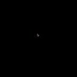
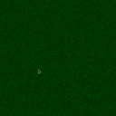
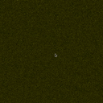

# Simple particle simulation with OpenGL compute shaders

This is a very basic simulation of a *lot* of particles in a 2D space.
You click left to attract them to your cursor and right to repel them from your cursor.
The compute shaders allow this to run in real-time with a lot more particles than if the physics were calculated on the CPU.

# Demos







# Dependencies

You'll need `glfw3`, `glew` and `glu` to be able to build the project.

A C++17 compatible compiler will be needed, but you can remove all code that uses `std::variant` and build it with C++11.

And you'll obviously need a GPU that supports compute shaders. This generally means OpenGL 4.3 or higher.

On laptops that have discrete GPUs it's better to use the discrete GPU.
On Linux you can generally do this with:

```
export DRI_PRIME=1
```

### On arch (X11)

```
pacman -S glfw-x11 glew
```

### On Ubuntu

```
apt install libglfw3-dev libglew-dev
```

# Possible issues

Some GPUs may have support for compute shaders, but not be fully OpenGL 4.3 compliant.
In such case on Linux you could try to force OpenGL 4.3 with:

```
export MESA_GL_VERSION_OVERRIDE=4.3
```
